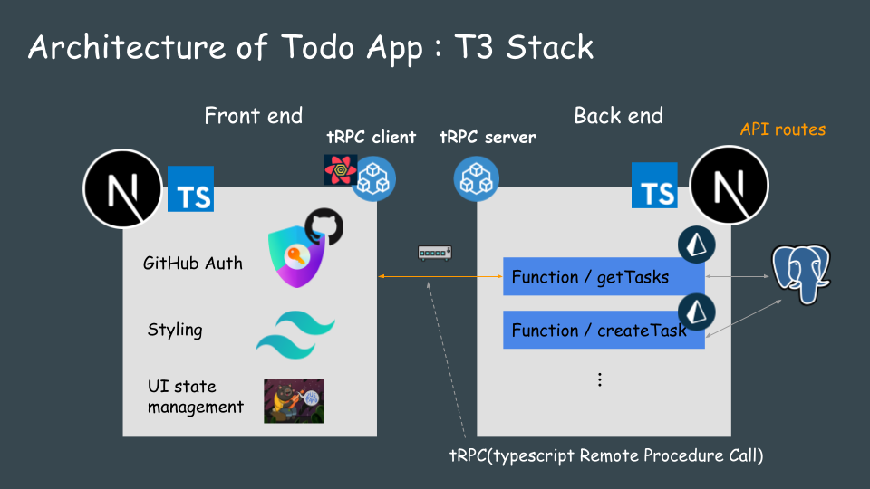

## Table of contents

- <a href="#about">About T3 Stack</a>
- <a href="#architecture">Architecture of Todo App</a>
- <a href="#project-setup">Project setup</a>

<h2 id="about">About T3 Stack</h2>

"T3 Stack" consists of following tech and enable full stack type-safe web development speedy and simple.

- [Next.js](https://nextjs.org)
- [tRPC](https://trpc.io)
- [Tailwind CSS](https://tailwindcss.com)
- [TypeScript](https://typescriptlang.org)
- [Prisma](https://prisma.io)
- [NextAuth.js](https://next-auth.js.org)

<h2 id="architecture">Architecture of Todo App</h2>

<h2 id="project-setup">Project setup</h2>

### Create T3 project
~~~bash
$ npm i -g yarn
$ npx create-t3-app@6.0.1 t3-todo-app
$ yarn add zustand @heroicons/react date-fns
~~~
### DB setup
~~~
# add docker-compose.yml file
# start db
$ docker compose up -d
# reset db
$ docker compose rm -s -f -v

# edit .env + schema.prisma

# prisma migrate and type generation
$ npx prisma migrate dev
$ npx prisma generate
$ npx prisma studio
~~~